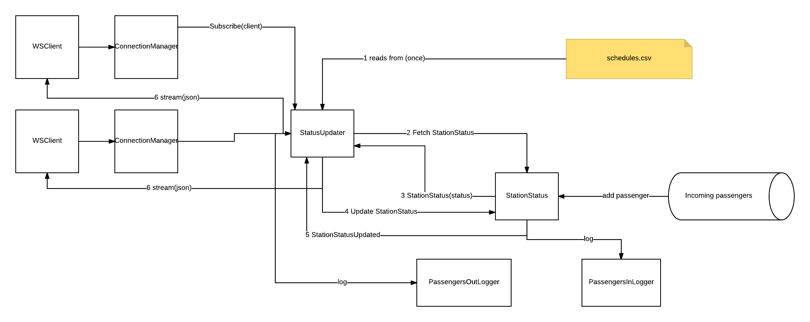

# Transmimetro

This realtime reactive play application uses akka actors to simulate the transmimetro system of Bogota.

## How to run ?

To run this application you will need sbt 0.13.8. To run it just type:

```
$ sbt run
```

The application would then be deployed to [localhost:9000](http://localhost:9000)

## Routes

In order to view to the live feed of informations such as the real time positions of each metro car, their capacity and
the amount of passengers in all the stations go to [here](http://localhost:9000/)

To view a daily report of each station:

```
/report/{station name in lowercase without spaces}
``` 
## Implementation notes

This application was implemented using Akka's actor system. The actors interaction is shown in the schema below.



Each actor has its' own role:

* The StatusUpdater reads the *schedules.csv* file at start up, and then each 3 seconds, it will update each metro car 
capacity, fetch the updated stations capacities, and update both of the capacities taking into account which metro car 
is in which station and where are passengers headed. It also tells the PassengersOut actor to log outgoing passengers for
each station. Finally, it broadcasts the updated information to all connected clients

* The StationStatus simulates the incoming passengers and updated its inner state accordingly. It also sends the stations'
information to the StatusUpdater. It is also responsable of telling the PassengersLogIn to log the incoming passengers to each station

* PassengersLogIn logs the incoming passenger to each station and creates the log folder if it does not exists.

* PassengersLogIOut logs the outcoming passenger in each station and creates the log folder if it does not exists.

* A ConnectionManager is created for each WebSocket Client, it tells the StatusUpdater when to subscribe incoming 
connections and when to unsubscribe closed ones.


